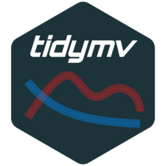

<!-- README.md is generated from README.Rmd. Please edit that file -->

```{r, include = FALSE}
knitr::opts_chunk$set(
  collapse = TRUE,
  comment = "#>",
  fig.path = "man/figures/README-",
  out.width = "100%"
)
```

# `tidymv`: Tidy Model Visualisation for Generalised Additive Models 

<!-- badges: start -->
`r badger::badge_cran_release("tidymv", "blue")`
`r badger::badge_cran_checks("tidymv")`
`r badger::badge_github_actions()`
`r badger::badge_devel(color = "orange")`
<!-- badges: end -->

This is the repository of the `R` package `tidymv`. This package provides functions for the visualisation of GAM(M)s and the generation of model-based predicted values using tidy tools from the `tidyverse`.

## Installation

The package is on CRAN, so you can install it from there with `install.packages("tidymv")`.

If you like living on edge, install a polished pre-release with:

```{r install-pre, eval=FALSE}
remotes::install_github(
  "stefanocoretta/tidymv",
  build_vignettes = TRUE
)
```

Or the development version with:

```{r install-dev, eval=FALSE}
remotes::install_github(
  "stefanocoretta/tidymv@devel",
  build_vignettes = TRUE
)
```

## Use

To learn how to use the package, check out the vignettes.

```{r vignettes, eval=FALSE}
# Check available vignettes
vignette(package = "tidymv")

# Open vignettes
vignette(<vignette-name>, package = "tidymv")
```

