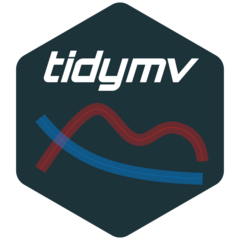

<!-- README.md is generated from README.Rmd. Please edit that file -->

# `tidymv`: Tidy Model Visualisation for Generalised Additive Models 

<!-- badges: start -->

[](https://cran.r-project.org/package=tidymv)
[](https://cran.r-project.org/web/checks/check_results_tidymv.html)
[](https://github.com/stefanocoretta/tidymv/actions)
[](https://github.com/stefanocoretta/tidymv)
[](https://doi.org/10.5281/zenodo.1343882)
<!-- badges: end -->

This is the repository of the `R` package `tidymv`. This package
provides functions for the visualisation of GAM(M)s and the generation
of model-based predicted values using tidy tools from the `tidyverse`.

## Installation

The package is on CRAN, so you can install it from there with
`install.packages("tidymv")`.

If you like living on edge, install a polished pre-release with:

``` r
remotes::install_github(
  "stefanocoretta/tidymv",
  build_vignettes = TRUE
)
```

Or the development version with:

``` r
remotes::install_github(
  "stefanocoretta/tidymv@devel",
  build_vignettes = TRUE
)
```

## Use

To learn how to use the package, check out the vignettes.

``` r
# Check available vignettes
vignette(package = "tidymv")

# Open vignettes
vignette(<vignette-name>, package = "tidymv")
```
